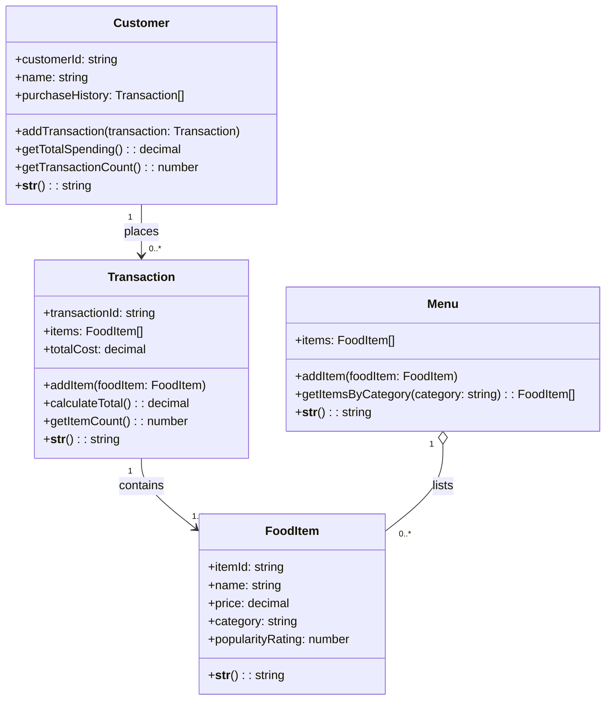

# ByteBites Domain Model

## Design Overview

**Customer** — Represents a verified user with identity and purchase history for accountability.

**FoodItem** — Represents a catalog entry with pricing, categorization, and popularity metrics for discovery.

**Menu** — Manages the complete collection of food items and provides category-based filtering for browsing.

**Transaction** — Groups selected items into a single checkout event and computes the total cost.

## Key Relationships

- **Customer places Transaction** — Each customer can have multiple purchases; transactions link back to the customer.
- **Transaction contains FoodItem** — A transaction bundles the specific items selected at checkout.
- **Menu lists FoodItem** — The menu is the authoritative catalog that all transactions reference.

## Design Decisions

- **Customer verification** — Purchase history is stored as Transaction references, allowing the system to verify real users through past activity.
- **Customer metrics** — `getTotalSpending()` and `getTransactionCount()` provide quick verification and analytics signals without requiring callers to inspect the history directly.
- **Food item validation** — `FoodItem` rejects empty names/categories and negative prices so the catalog stays clean and consistent.
- **Food item logging** — `__str__()` gives a readable representation for debugging and audit output.
- **Menu safety** — `Menu` copies incoming item collections, validates added items, and exposes a simple string representation for debugging.
- **Transaction safety** — `Transaction` copies incoming items, validates added items, and can report item count plus a readable summary string.
- **No quantity tracking** — Items are added to a transaction as-is; if a customer selects the same item twice, it appears twice in the items array. This matches the spec requirement without overcomplicating the model.
- **Category filtering on Menu** — The `getItemsByCategory()` method enables browsing by "Drinks" or "Desserts" without duplicating data.
- **Computed total cost** — `calculateTotal()` is a behavior, not stored data, ensuring accuracy whenever it's called.

---

