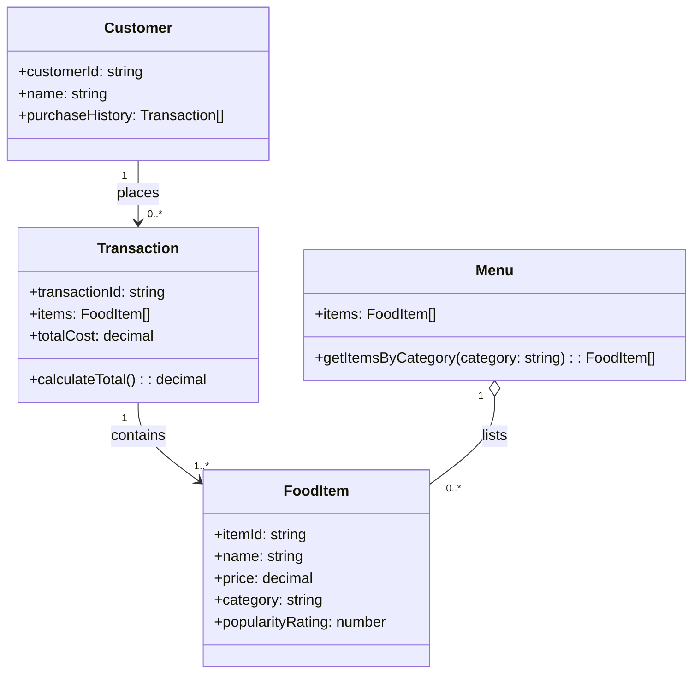

# ByteBites Domain Model

## Design Overview

**Customer** — Represents a verified user with identity and purchase history for accountability.

**FoodItem** — Represents a catalog entry with pricing, categorization, and popularity metrics for discovery.

**Menu** — Manages the complete collection of food items and provides category-based filtering for browsing.

**Transaction** — Groups selected items into a single checkout event and computes the total cost.

## Key Relationships

- **Customer places Transaction** — Each customer can have multiple purchases; transactions link back to the customer.
- **Transaction contains FoodItem** — A transaction bundles the specific items selected at checkout.
- **Menu lists FoodItem** — The menu is the authoritative catalog that all transactions reference.

---

