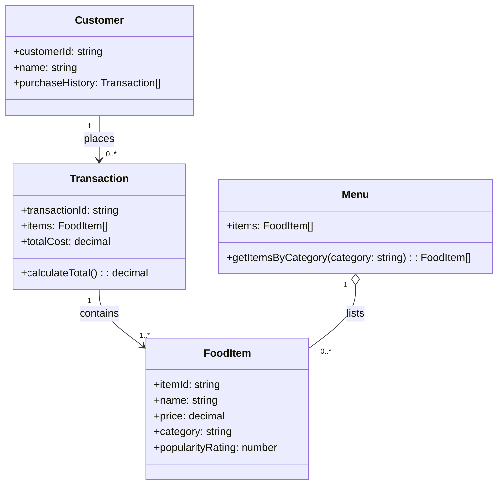

```mermaid
classDiagram
    class Customer {
        +customerId: string
        +name: string
        +purchaseHistory: Transaction[]
    }

    class FoodItem {
        +itemId: string
        +name: string
        +price: decimal
        +category: string
        +popularityRating: number
    }

    class Menu {
        +items: FoodItem[]
        +getItemsByCategory(category: string): FoodItem[]
    }

    class Transaction {
        +transactionId: string
        +items: FoodItem[]
        +totalCost: decimal
        +calculateTotal(): decimal
    }

    Customer "1" --> "0..*" Transaction : places
    Transaction "1" --> "1..*" FoodItem : contains
    Menu "1" o-- "0..*" FoodItem : lists
```
